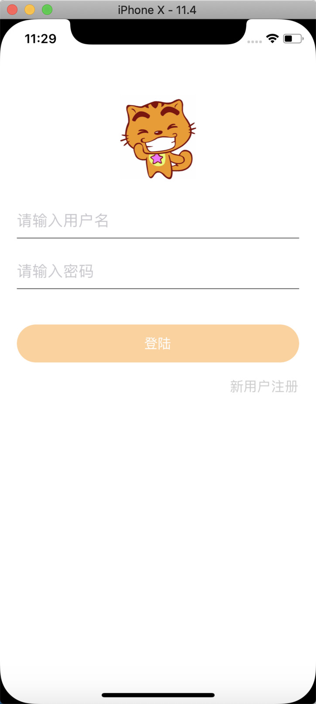
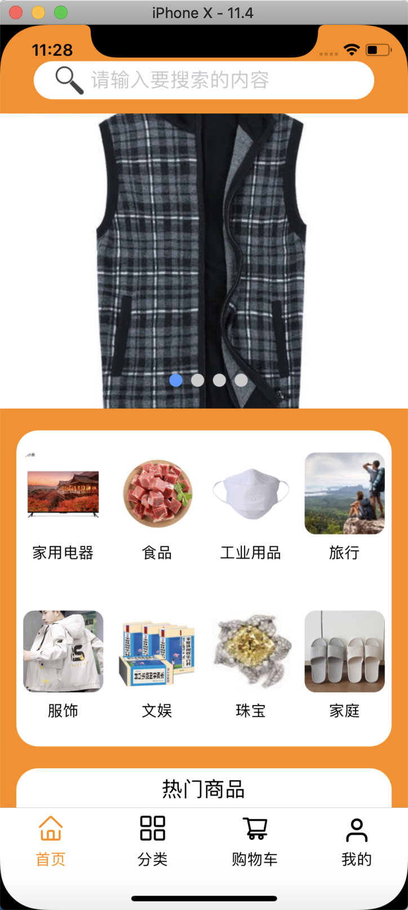
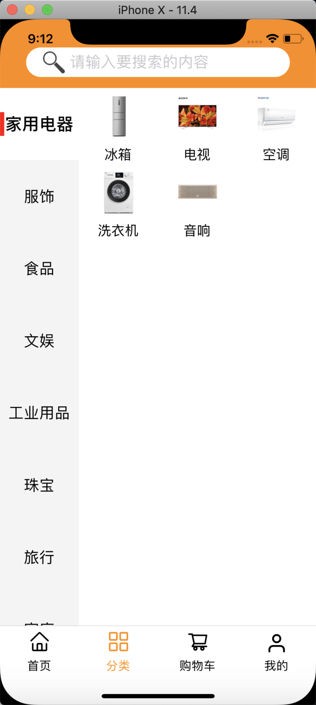
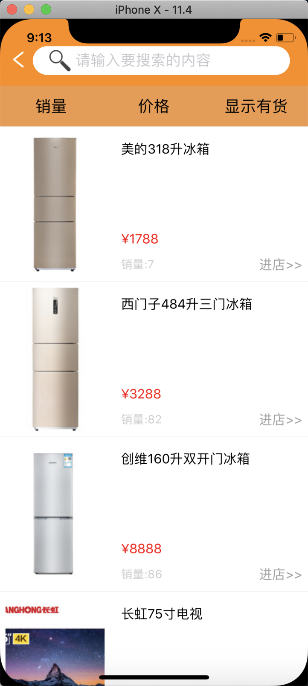
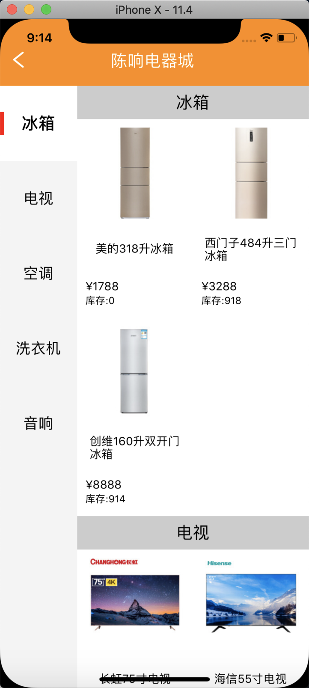
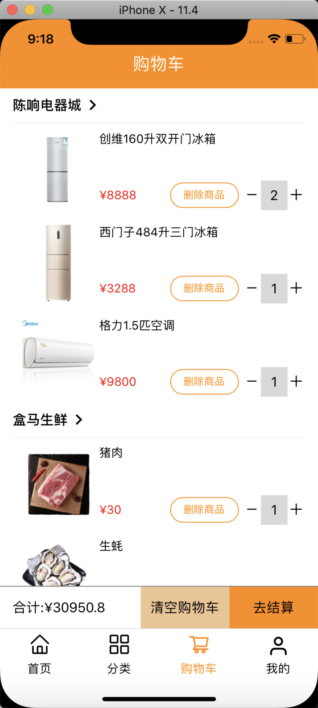
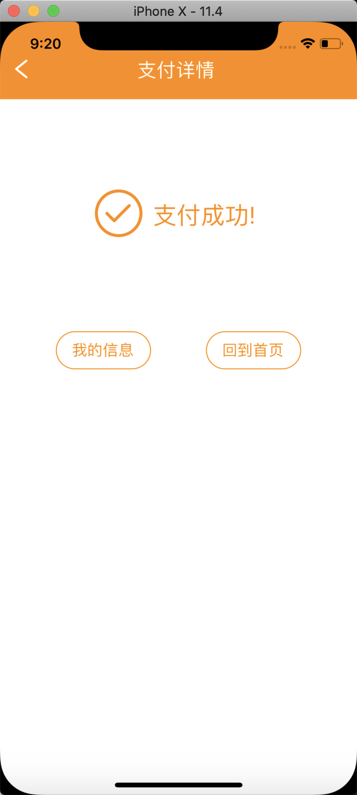
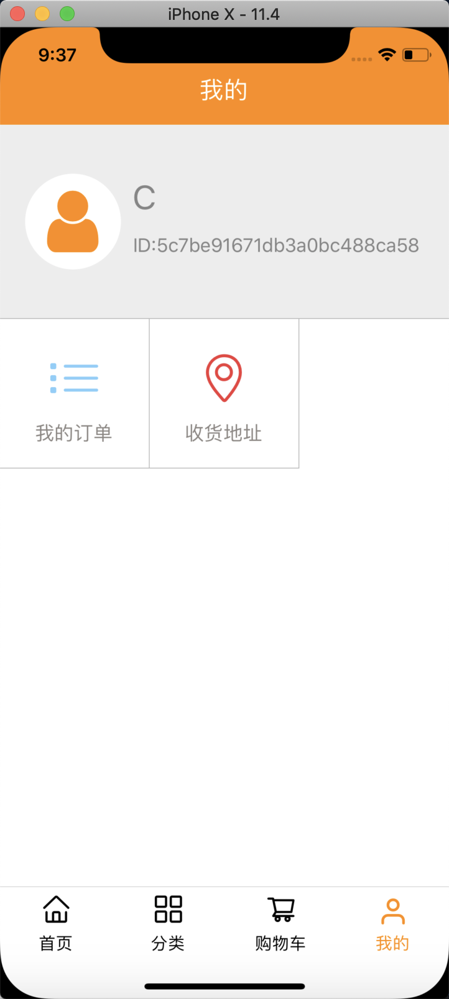
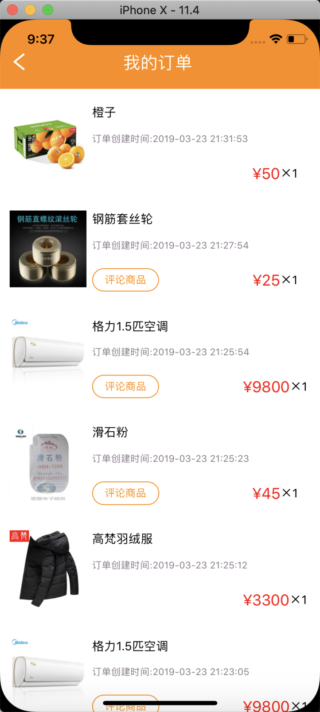
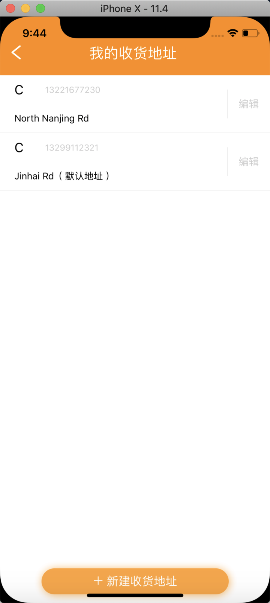

## Introduce
This was a simple shopping mall application , l used the React Native framework to create the application's front-end (View and Controller), my partner used the nodejs to create the APP's back-end.

## Environmental configuration


* See: [Getting Started](https://facebook.github.io/react-native/docs/getting-started) (Install dependencies except React Native CLI => VERSION CONFLICTION)

* Configure IP address : Open ```ipconfig.json``` and replace ```192.168.1.24``` with local address

## Cooperative module(necessary)

* Back-end : [Online shopping application's Back-end ](https://github.com/chenxiang39/RN-ShoppingMall-Nodejs)

## Running this application

1.Install the modules
```
cd (Project path)
npm install
```

2.Run

```
//IOS
react-native run-ios
//Android
react-native run-android
```

## Screenshots

<div>



</div>
<div>



</div>
<div>



</div>  
<div>



</div>     

## Language	

I must say sorry here, owing to that this app was originally based on Chinese data, so the language of this app was Chinese (there was no multilingual processing at that time) and it was complicated to change.


So I wrote ```locale. txt``` to explain the basic functions of my program.


    If you have any question, please send me an email.

    E-mail address : 2251122920@qq.com
